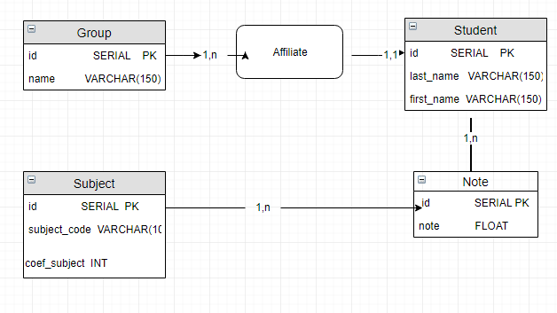

# Management Note HEI API documentation 

The **Management Note HEI API** is designed to facilitate the management of note-related information at HEI (Haute Ecole Informatique). This API provides endpoints to manage note, students, group and subject allowing administrators to efficiently handle various operations related to contests and student performance assessment.

## Introduction
The Management Note HEI API is built using the Spring Boot framework and follows RESTful design principles. It offers endpoints to note, students, group and subject. The API's main functionalities include inserting, updating,deleting, and retrieving note-related information.

### Note Controller
- `POST /note-create`: Insert a new note.
- `GET /notes`: Retrieve a list of all notes.
- `GET /notes/{id}`: Retrieve note information by its ID.
- `PUT /notes/{id}`: Update note information.
- `DELETE /notes/{id}`: Delete a  note.
- `GET /notes/student/{studentId}`: Retrieve note information by student .
- `GET /notes/subject/{subjectId}`: Retrieve note information by subject .

### Conceptual Data Model (MCD)

## Usage
To get started with the Management Note HEI API, follow these steps:

1. **Clone this Repository**: Begin by cloning this repository to your local machine. You can do this by running the following command in your terminal:
   `git clone <https://github.com/MihajaFi/Gestion-Note-HEI.git>`

2. **Reload Maven and Start the Server**: Ensure that you have Maven installed on your system. After cloning the repository, navigate to the project directory and  reload Maven in pom.xml and start the server in the main application:

3. **Database Requirement**: Make sure you have PostgreSQL installed on your system or have access to a PostgreSQL database. The application requires PostgreSQL for data storage. Run the script in static/ 
 You can configure the database connection in the `application.properties` file.
4. **Making API Requests**: You can interact with the Contest Note Management API by making HTTP requests to the respective endpoints. You can use tools like `curl`, Postman, or any programming language that supports HTTP requests. For example, to retrieve a list of all contests, you can send a GET request to the following endpoint .

Feel free to explore other endpoints for managing note, students, group and subject as needed.